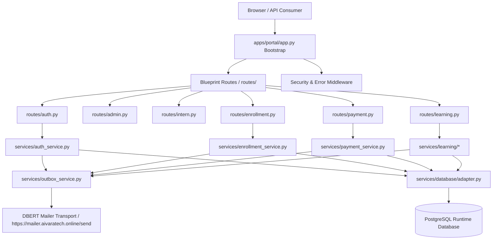

# DBERT LMS Architectural Dependency Graph

```mermaid
graph TD
    Client[Browser / API Consumer] --> Bootstrap[apps/portal/app.py Bootstrap]
    
    Bootstrap --> Routes[Blueprint Routes / routes/]
    Bootstrap --> Middleware[Security & Error Middleware]
    
    Routes --> AuthBP[routes/auth.py]
    Routes --> AdminBP[routes/admin.py]
    Routes --> InternBP[routes/intern.py]
    Routes --> EnrollBP[routes/enrollment.py]
    Routes --> LearnBP[routes/learning.py]
    Routes --> PayBP[routes/payment.py]
    
    AuthBP --> AuthService[services/auth_service.py]
    EnrollBP --> EnrollService[services/enrollment_service.py]
    PayBP --> PayService[services/payment_service.py]
    LearnBP --> LearnEngine[services/learning/*]
    
    AuthService & EnrollService & PayService & LearnEngine --> Outbox[services/outbox_service.py]
    Outbox --> MailerClient[DBERT Mailer Transport / https://mailer.aivaratech.online/send]
    
    AuthService & EnrollService & PayService & LearnEngine --> DBAdapter[services/database/adapter.py]
    DBAdapter --> PostgreSQL[(PostgreSQL Runtime Database)]
```
