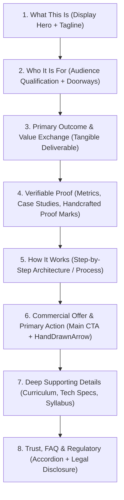

# DBERT Website Content Hierarchy & Information Architecture Audit (Phase 0 Baseline)

## Scope & Objective
Audit content structure, section sequencing, cognitive density, CTA clarity, and storytelling rhythm across all primary business verticals.

**Core Invariant**: Handcrafted elements (margin notes, hand-drawn arrows, proof marks, marker highlights) serve as key human navigation beacons within dense technical sections and must remain intact.

---

## 1. Universal Standard Page Anatomy

To resolve content sprawl and reduce reader fatigue, every long-form landing and business page must align with the standardized 8-beat scannable sequence:

---

## 2. Vertical-by-Vertical Hierarchy Audit

### 2.1 Homepage (`/`)
* **Current Order**:
  1. Header / Navigation
  2. Studio Status Terminal (`studio status - 4 ventures in active build`) + Headline
  3. Live Feed (`StudioConsole`) with margin note `<HandNote>this is our actual day</HandNote>`
  4. Proof stats counter (`CountUp`: ventures, products, fellows, faster to market)
  5. Ambient Fact Ticker (`FactTicker`)
  6. Audience Doors (`AudienceDoors`: Startups, Enterprise AI, Learners)
  7. 4-Step Incubation Process (`ProcessSteps`)
  8. Enterprise Products Grid (DBERT Chat, Document AI, Cert API, Hiring Suite, IMS)
  9. Learner Ladder (Launchpad, Accelerate, Fellowship) with `<HandNote tone="blue">structured progression</HandNote>`
  10. Case Proof (Alkame Case Study)
  11. Founder Statement & Studio Mission
  12. Bottom CTA with `<HandDrawnArrow>` and `<HandNote>`
  13. Footer
* **Hierarchy Assessment**:
  * **Strengths**: Extremely compelling, unique engineering personality; handcrafted annotations make the page feel like an active, breathing workshop.
  * **Weaknesses**: The sequence from Studio Console -> Proof Stats -> Fact Ticker -> Audience Doors feels visually compressed. The SSR `0` values in `CountUp` weaken the initial impression.
  * **Planned Recomposition**:
    * Cleanly separate the hero status terminal from the proof stats.
    * Progressively enhance `CountUp` to render real numbers on SSR.
    * Ensure the three doors (Startups, Products, Learners) stand out as the primary pathways.

---

### 2.2 Startups Vertical (`/startups`, `/startups/services/*`, `/startups/portfolio/*`)
* **Current Order**:
  1. Equity Incubation Hero ("We Build Your MVP For Equity")
  2. Operating Matrix (2–8% equity model)
  3. Services Grid (Technical Architecture, Hiring, Legal, Cloud Infrastructure, Seed Syndicate)
  4. Portfolio Highlights (Alkame, Cognitive Solutions, Digital Blaize, Gayatri AI)
  5. Application Form & CTA with `<HandDrawnArrow>`
* **Hierarchy Assessment**:
  * **Strengths**: Direct, no-fluff commercial proposal.
  * **Weaknesses**: High density of contractual terms before the founder sees proof of technical execution.
  * **Planned Recomposition**:
    * Move case study proof (Alkame) earlier, right after the core equity proposition.
    * Use structured cards for services rather than dense paragraphs.
    * Keep `<HandNote>` margin notes highlighting key founder benefits (e.g., "0 cash burn").

---

### 2.3 Enterprise AI & Products (`/ai-solutions`, `/ai-solutions/products/*`, `/ai-solutions/llm-training/*`)
* **Current Order**:
  1. Sovereign Enterprise AI Hero
  2. Products Overview (DBERT Chat, Document AI, Cert API, Hiring Suite, Intern Management)
  3. Deep Technical Training Pipeline (`/pipeline` with interactive architecture console)
  4. On-Premise & Sovereign Infrastructure specs
  5. Consultation Booking CTA
* **Hierarchy Assessment**:
  * **Strengths**: The interactive pipeline console (`PipelineInteractiveConsole`) and handcrafted notes (`"zero external telemetry"`, `"bank grade isolation"`, `"runs cool on desk"`) provide unmatched technical credibility.
  * **Weaknesses**: Enterprise buyers may confuse custom LLM engineering services with ready-to-deploy SaaS licenses.
  * **Planned Recomposition**:
    * Clearly bifurcate "Off-the-shelf SaaS Products (Ready for VPC)" and "Bespoke Model Fine-Tuning & Infrastructure".
    * Add concise capability comparison cards with SLA metrics.

---

### 2.4 Learners Vertical (`/learners`, `/learners/launchpad`, `/learners/accelerate`, `/learners/fellowship`)
* **Current Order**:
  1. Engineering Career Ladder Hero
  2. 3-Tier Ladder: Launchpad (0-to-1) -> Accelerate (Intermediate) -> Fellowship (Advanced)
  3. Curriculum Highlights & Real Production Code Guarantee
  4. Placement Network & Hiring Partners (`/hire/pre-vetted-engineers`)
  5. Screening & Application CTA
* **Hierarchy Assessment**:
  * **Strengths**: Clear pedagogical progression; strong distinction between typical coding bootcamps and DBERT's production engineering squads.
  * **Weaknesses**: Information density on course detail pages requires extensive scrolling before reaching syllabus outcomes.
  * **Planned Recomposition**:
    * Introduce consistent program summary badges: Duration, Prerequisites, Time Commitment, Squad Size, Capstone Project.
    * Ensure `<HandNote>` annotations ("direct screening entry available") remain prominent.

---

### 2.5 Labs & About (`/labs/*`, `/about/*`)
* **Current Order**:
  1. Institutional Philosophy Hero
  2. Open Source Contributions & Academic Preprints
  3. Core Practitioners & Architects Roster
  4. Engineering Audits & Verification Badges (`/about/credentials`)
  5. Contact & Collaboration Intake
* **Hierarchy Assessment**:
  * **Strengths**: Exceptional institutional authority; clear academic rigor.
  * **Weaknesses**: Separation between research initiatives and commercial incubations can become blurry.
  * **Planned Recomposition**:
    * Elevate practitioner bios and GitHub / arXiv links.
    * Maintain `.proof-mark` badges for verified credentials.

---

## 3. CTA Prominence & Collision Matrix

| Section / Page | Primary CTA | Competing Secondary CTAs | Recommendation |
|---|---|---|---|
| **Homepage Hero** | "Browse products" | "Apply for Incubation" | Keep primary blue button on "Apply for Incubation", subtle outline on "Browse Products" to eliminate visual rivalry. |
| **Startups Hub** | "Apply for Incubation" | "Explore Services", "Download Term Sheet" | Maintain "Apply for Incubation" as solitary filled primary; keep others as text links with trailing arrows. |
| **Enterprise Products** | "Request Demo" / "Request API Key" | "View Documentation", "Contact Sales" | Unify on a single high-contrast primary CTA per product card. |
| **Learner Fellowship** | "Apply for Screening" | "Download Syllabus", "Explore Launchpad" | Visually anchor "Apply for Screening" with the amber `<HandDrawnArrow>`. |

---

## 4. Handcrafted Element Placement Strategy

To fulfill the mandate **"keep handcrafted elements in place"**, handcrafted assets will continue to be deployed purposefully across key conversion and explanation checkpoints:

1. **Homepage Hero**: `<HandNote>this is our actual day</HandNote>` on the live terminal console.
2. **Progression Ladder**: `<HandNote tone="blue">structured progression</HandNote>` guiding learners between Launchpad and Fellowship.
3. **Primary Bottom CTAs**: `<HandDrawnArrow>` with handwritten guidance notes pointing founders and applicants to action triggers.
4. **Pipeline Architecture**: Margin annotations highlighting data privacy (`"zero external telemetry"`) and hardware autonomy (`"bank grade isolation"`).
5. **Brand Proof**: `.marker` SVG underlines and `.proof-mark` badges highlighting real production metrics.
