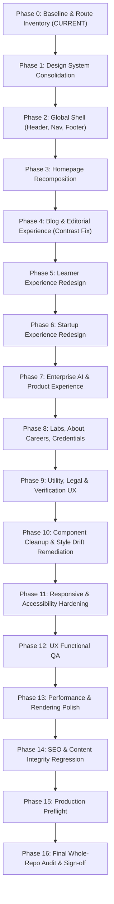

# DBERT Website UI/UX Redesign & Remediation Master Phase Plan

## 1. Executive Mandate & Core Principles
- **Target Site**: `https://dbert.online` (Repository: `DBERT-INDIA/dbert-website-lms`, Scope: `apps/website/**`)
- **Primary Goal**: Elevate visual craftsmanship, solve information density, eliminate style drift, and fix contrast and UX bugs without breaking existing business flows, SEO, verification APIs, payment processing, or navigation reachability.
- **Handcrafted Preservation Invariant**: **All handcrafted elements remain firmly in place.** The handwritten Caveat margin notes (`<HandNote>`), animated SVG directional arrows (`<HandDrawnArrow>`), marker underlines, highlighter swipes, proof marks, and blueprint atmospheric grid constitute DBERT's authentic studio identity and will not be removed, flattened, or replaced with generic UI kits.
- **Workflow Protocol**: Strict phase-by-phase execution locally, automated tests and whole-site regressions, breakpoint visual QA, user approval checkpoints, git commits, and remote pushes.

---

## 2. Phase-by-Phase Roadmap (Phase 0 to Phase 16)

---

## 3. Phase 0: Baseline, Route Inventory & Visual Evidence (COMPLETED)
- **Status**: Implemented & verified.
- **Deliverables Created**:
  - `WEBSITE_ROUTE_INVENTORY.md`: All 90 routes cataloged with layout, density, responsive health.
  - `WEBSITE_DESIGN_SYSTEM_AUDIT.md`: Typography, token mapping, `--ink` collision analysis, handcrafted inventory.
  - `WEBSITE_BUG_REGISTER.md`: Bug classification (`BLOG-UI-001`, `SEO-ERR-001`, `HOME-DAT-001`, `HOME-REP-001`, `NAV-UX-001`, `STYLE-SPRAWL-001`, `A11Y-HEAD-001`).
  - `WEBSITE_CONTENT_HIERARCHY_AUDIT.md`: Scannability, section rhythm, CTA balance analysis.
  - `WEBSITE_UIUX_PROGRESS.md`: Master tracking matrix for all 17 phases.
  - Automated audit scripts in `apps/website/scripts/`: `audit-routes.mjs`, `check-ui-tokens.mjs`, `check-inline-styles.mjs`, `check-placeholders.mjs`, `check-headings.mjs`.

---

## 4. Phase 1: Design System Consolidation (Detailed Next Phase Plan)

### Objective
Establish a single, mathematically cohesive design token architecture in `apps/website/src/app/globals.css` that eliminates the `--ink` contrast hazard, provides semantic surface and content tokens, and standardizes spacing, cards, and buttons while preserving all handcrafted elements.

### Tasks to Implement in Phase 1:
1. **Define Semantic Tokens**:
   - Surface Tokens:
     - `--surface-base`: `#06090F` (Base canvas)
     - `--surface-raised`: `#0B101A` (Elevation 1: sidebars, toolbars)
     - `--surface-card`: `#0F1523` (Elevation 2: default cards)
     - `--surface-card-hover`: `#141C2E` (Elevation 3: hovered cards)
     - `--surface-overlay`: `rgba(6, 9, 15, 0.85)` (Modal and drawer backdrop)
   - Content / Text Tokens:
     - `--text-primary`: `#EEF2FA` (High-contrast titles and headings)
     - `--text-secondary`: `#D1D9E6` (Clean reading paragraphs)
     - `--text-muted`: `#93A0B8` (Descriptions and captions)
     - `--text-faint`: `#7A726A` (Metadata and timestamps)
     - `--text-on-accent`: `#05070C` (Text on electric blue/amber buttons)
   - Border Tokens:
     - `--border-subtle`: `rgba(148, 163, 196, 0.12)`
     - `--border-strong`: `rgba(148, 163, 196, 0.22)`
     - `--border-focus`: `var(--accent)`
2. **Eliminate `--ink` Foreground Misuse**:
   - Retain `--ink` strictly as a surface alias for `--surface-base`.
   - Never allow `color: var(--ink)` in text selectors.
3. **Protect & Formalize Handcrafted Element Tokens**:
   - Ensure `--font-h` (Caveat cursive) is mapped to `.handnote`, `.handnote.blue`, and `<HandNote>`.
   - Ensure `.marker`, `.hl-swipe`, `.redline-del`, and `.proof-mark` retain their authentic styling and keyframe animations.
   - Maintain the blueprint grid (`body::before`) and optimized film grain (`body::after`).
4. **Standardize Component Primitives**:
   - Card types: `.card`, `.card-lift`, `.bento-card`.
   - Button variants: `.btn-primary` (electric blue fill), `.btn-outline` (subtle border with hover glow), `.btn-ghost` (minimal text button).
5. **Phase 1 Verification Gates**:
   - Run `npx tsc --noEmit` -> Must pass with 0 errors.
   - Run `npm run lint` -> Must pass with 0 warnings.
   - Run `node scripts/check-ui-tokens.mjs` -> Zero illegal token usages.
   - Build test: `npm run build` -> All 90 routes compile cleanly.

---

## 5. Roadmap for Subsequent Phases (Phases 2 to 16)
- **Phase 2 (Global Shell)**: Refine header mega menus with clear visual categorization, upgrade footer sitemap, preserve mobile drawer focus lock and Escape handling.
- **Phase 3 (Homepage Recomposition)**: Progressively enhance `CountUp.tsx` so SSR renders genuine approved figures instead of `0`; polish `FactTicker` marquee rhythm; clarify audience doors.
- **Phase 4 (Blog & Editorial)**: Complete resolution of `BLOG-UI-001` across all 5 MDX posts; optimize reading typography, code blocks, quotes, and author boxes.
- **Phase 5 (Learners Vertical)**: Standardize program detail templates, simplify syllabus scanning, and preserve course progression annotations.
- **Phase 6 (Startups Vertical)**: Elevate equity value proposition, streamline incubation services grid, and showcase case studies early.
- **Phase 7 (Enterprise AI)**: Separate VPC SaaS products from custom LLM training; enhance interactive pipeline console.
- **Phase 8 (Labs & About)**: Strengthen academic preprints, practitioner credibility, and verified credential tags.
- **Phase 9 (Utility, Legal & Verification)**: Upgrade `/verify` states (loading, valid, invalid, error); add sticky mini-TOC to `/privacy`, `/terms`, `/refund`.
- **Phase 10 (Component Cleanup)**: Refactor inline styles in `CohortApplicationsClient.tsx`, `ai-consultant`, and `hire/pre-vetted-engineers` into CSS modules.
- **Phase 11 (Responsive & Accessibility)**: Audit 10 viewports (360px to 1920px); resolve heading skipping (`A11Y-HEAD-001`).
- **Phase 12 (UX Functional QA)**: Exhaustive manual and scripted interaction check of all forms, navigation, accordions, and links.
- **Phase 13 (Performance & Polish)**: Optimize LCP/CLS, ensure `prefers-reduced-motion` compliance, and optimize image assets.
- **Phase 14 (SEO & Content Integrity)**: Validate metadata across 64 pages (including `/hire/pre-vetted-engineers` character count fix); run internal link crawler.
- **Phase 15 (Production Preflight)**: Full production build, zero console errors, security check.
- **Phase 16 (Final Whole-Repo Audit)**: Clean repository tree, zero dead styles, final git commit and push.

---

## 6. Phase 13: Performance & Rendering Polish (Detailed Execution Plan)

### Objective
Maximize client runtime efficiency, minimize Cumulative Layout Shift (CLS) and Largest Contentful Paint (LCP), optimize Next.js asset compression, throttle passive scroll listeners with `requestAnimationFrame`, and enforce 100% compliance with `prefers-reduced-motion: reduce` across all interactive client components while preserving authentic studio aesthetics (film grain, blueprint grid, handwritten annotations).

### Scope of Work
1. **Next.js Asset & Image Pipeline Optimization**:
   - Update `apps/website/next.config.js` to enable cutting-edge image compression formats: `images: { formats: ['image/avif', 'image/webp'] }`.
   - Verify explicit aspect ratio and dimensional properties on all `<Image>` calls to guarantee zero CLS.
2. **Scroll Listener Throttling & Frame Hygiene**:
   - Refactor `apps/website/src/components/ui/ScrollProgress.tsx` to debounce/schedule scroll calculations using `requestAnimationFrame`, avoiding unnecessary DOM read/write cycles during continuous user scrolling.
   - Refactor `apps/website/src/components/ui/BackToTop.tsx` to optimize viewport scroll checks with `requestAnimationFrame` and honor `prefers-reduced-motion` in `window.scrollTo({ behavior })`.
3. **Motion Sensitivity & Resource Conservation**:
   - Update `apps/website/src/components/ui/RevealObserver.tsx` to bypass `IntersectionObserver` creation entirely when `prefers-reduced-motion: reduce` is active, immediately marking elements with `.in`.
   - Confirm global film grain (`body::after`) and ambient marquee (`FactTicker.module.css`) honor reduced motion settings without visual artifacting.
4. **Zero-Regression Verification**:
   - `npm run audit:tokens`
   - `node scripts/check-headings.mjs`
   - `node scripts/check-inline-styles.mjs`
   - `npm run check:seo`
   - `npx tsc --noEmit`
   - `npm run lint`
   - `$env:DATABASE_URL=...; npm run build` (verify all 90 routes compile with AVIF/WebP enabled)

---

## 7. Phase 14: SEO & Content Integrity Regression (Detailed Execution Plan)

### Objective
Exhaustively verify SEO metadata, OpenGraph tags, canonical URLs, structured data (JSON-LD), sitemap, and robots configurations across all routed pages. Guarantee that visual enhancements have not altered commercial claims, legal content, or broken internal link meshes.

### Scope of Work
1. **Canonical & URL Authority Alignment**:
   - Align default site URL in `apps/website/src/app/layout.tsx` (`metadataBase`) and `apps/website/src/app/robots.ts` to `https://dbert.online` as the definitive production fallback, matching `sitemap.ts`.
2. **Metadata & Structured Data Audit**:
   - Verify `seoConfig` compliance using `npm run check:seo`: title length (≤ 52 chars), description length (140–155 chars), keyword presence, and 100% coverage across all routed pages without duplicate keyword allocations.
   - Verify Organization schema in `layout.tsx` and educational schemas on course detail templates.
3. **Sitemap & Robots Validation**:
   - Verify `sitemap.ts` includes all indexable routes and dynamic blog posts while excluding `noindex` administrative endpoints.
   - Verify `robots.ts` disallows `/admin/`, `/login/`, and `/api/` while properly referencing the absolute `sitemap.xml`.
4. **Heading Hierarchy Integrity**:
   - Run `node scripts/check-headings.mjs` to ensure 0 pages with missing `<h1>`, 0 pages with multiple `<h1>`, and 0 skipped heading levels across all 66 pages.
5. **Zero-Regression Protocol**:
   - `npm run audit:tokens`
   - `node scripts/check-headings.mjs`
   - `node scripts/check-inline-styles.mjs`
   - `npm run check:seo`
   - `npx tsc --noEmit`
   - `npm run lint`
   - `$env:DATABASE_URL=...; npm run build`

